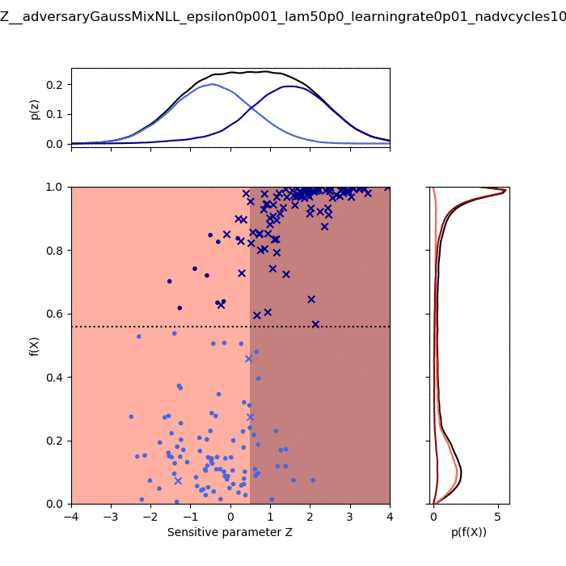

# FairML
Fairness in ML with adversarial training. Based on [1611.01046](https://arxiv.org/abs/1611.01046).

The goal is to predict y (circle or x in top left) based on features x1 and x2. However, predictions must be fair w.r.t. Z (shown as colour of xs in top left).

The evolution of classifier performance as the adversarial training progresses is shown in remaining figures:

- Top right shows the decision surface in x1, x2 space, which becomes a plane constant in x2.

- Bottom figures show the ROC curves and classifier distributions for Z in {1, 0, -1} which converge as training progresses.

Finally, the plot below shows how the classifier adjusts its response (f(X)) at high and low values of Z to achieve
fairness w.r.t to this parameter.

